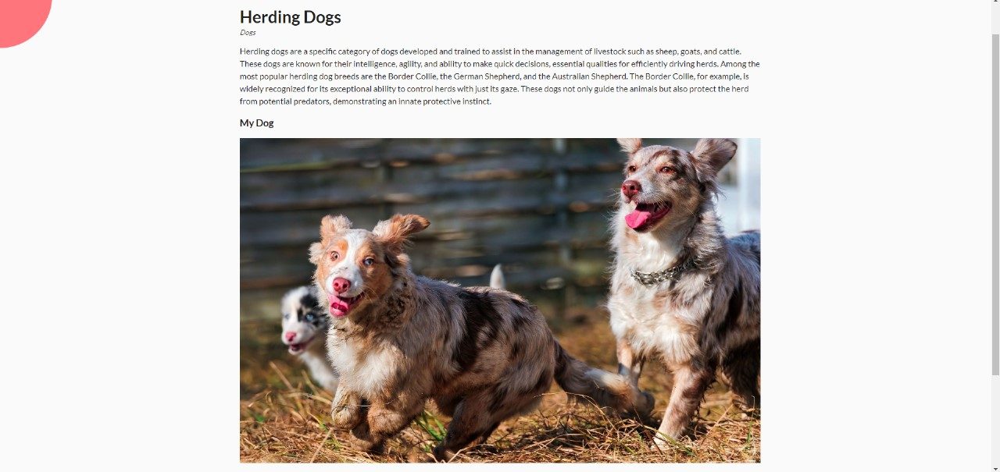
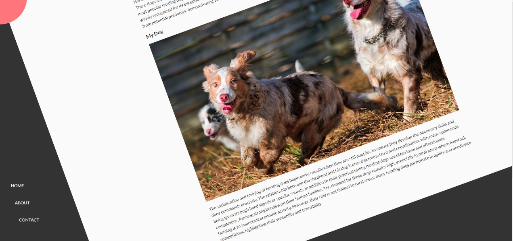
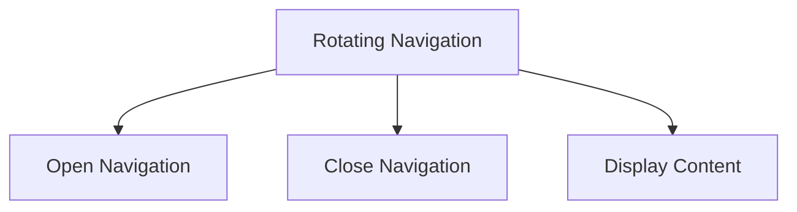

Project Documentation: Rotating Navigation




Overview

This project is an example of rotating navigation implemented with HTML, CSS, and JavaScript. 
It features an interactive and responsive design where the site navigation rotates to reveal or hide menu items. 
The interface is enhanced with icons from the Font Awesome library.

1. Technologies Used
HTML5: Structure of the page.
CSS3: Styling and animations.
JavaScript (ES6): Interactivity.
Libraries:
Font Awesome: Icons for navigation buttons.

2. Features
Rotating Navigation:

2.1 Buttons to open (#open) and close (#close) the navigation.
Rotation animation applied to the main container and the circle containing the navigation buttons.
Navigation Items:

2.3 Icons for Home, About, and Contact.
Smooth entry transitions for navigation items when the navigation is opened.
Content:

2.4 Display of information about herding dogs.
Illustrative image.
UML Diagrams
Use Case Diagram

# Rotating Navigation Diagram



```M
classDiagram
    class Container {
        - show-nav: boolean
        + addClass(class: string): void
        + removeClass(class: string): void
    }

    class Button {
        - id: string
        + click(): void
    }

    class Content {
        - img: Image
        - text: string
    }

```

```M
sequenceDiagram
    participant User
    participant Container
    participant ButtonOpen as Button (#open)
    participant ButtonClose as Button (#close)

    User ->> ButtonOpen: click()
    ButtonOpen ->> Container: addClass(show-nav)
    User ->> ButtonClose: click()
    ButtonClose ->> Container: removeClass(show-nav)

```

Conclusion
This project demonstrates the integration of HTML, CSS, and JavaScript to create an interactive and visually appealing navigation.
 The UML documentation helps visualize the structure and interactions within the project,
 facilitating understanding and maintenance of the code.
